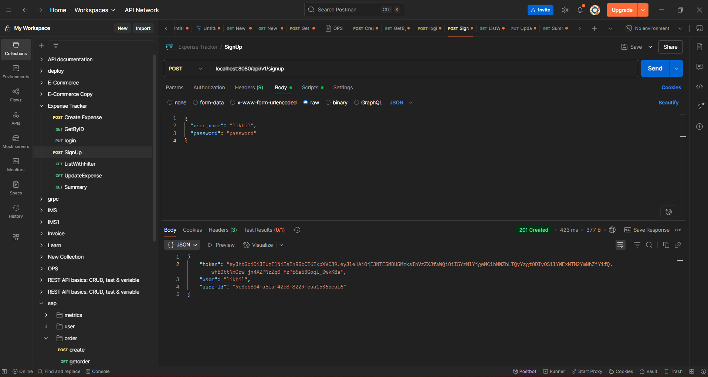
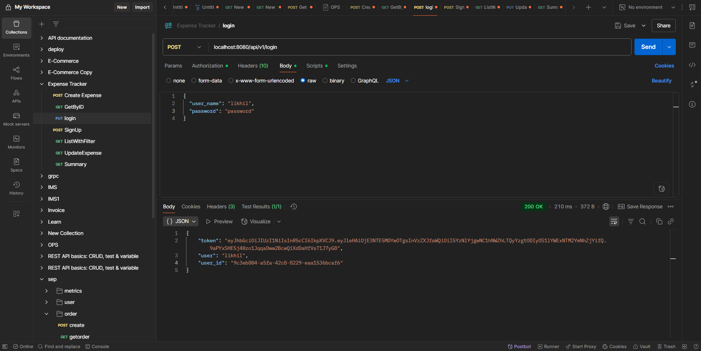
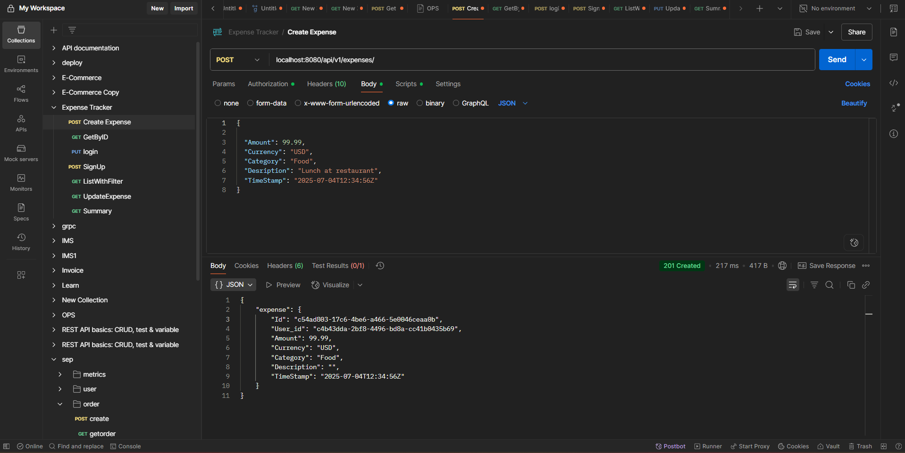
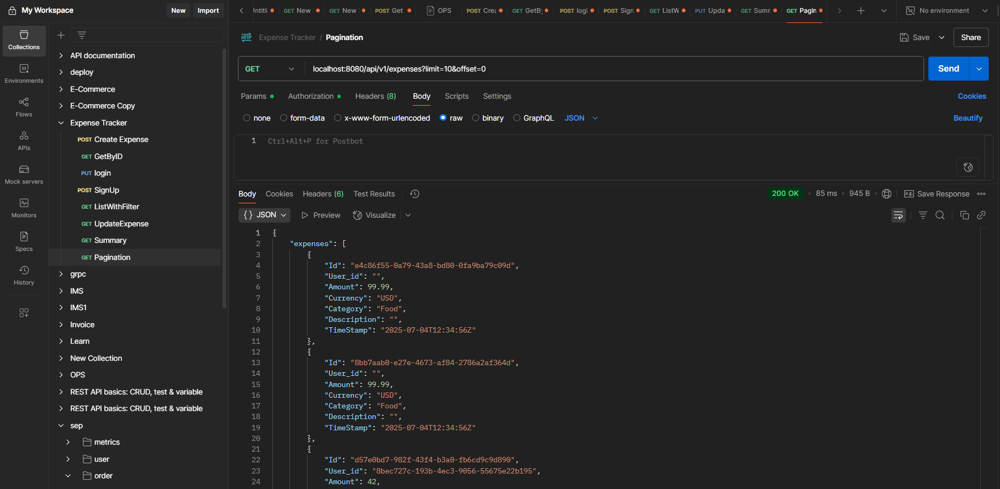
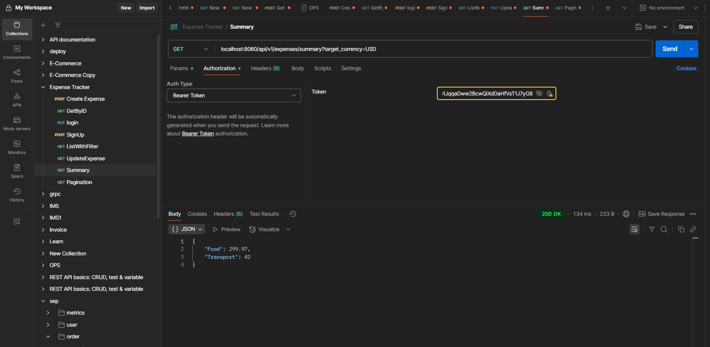
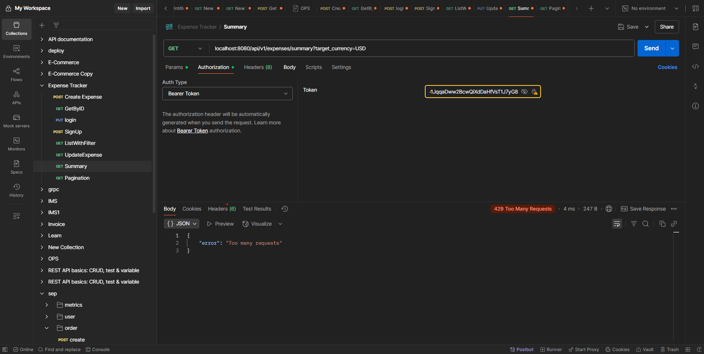

Expense Tracker API
A production-grade REST API for expense tracking, built with Go, Gin, GORM, PostgreSQL, JWT Auth, rate limiting, and Docker.

🚀 Setup & Run Instructions

1. Clone the repository
   git clone https://github.com/yourusername/expense-tracker.git
   cd expense-tracker

2. Configure environment
   Copy .env.example to .env and edit as needed:
   cp .env.example .env

3. Build & Run with Docker Compose
   docker-compose up --build

The API will be available at http://localhost:8080.

📝 API Usage Examples
Authentication

Sign Up
curl -X POST http://localhost:8080/api/v1/signup \
 -H "Content-Type: application/json" \
 -d '{"user_name":"alice","password":"mypassword"}'

Screenshot:

Login
curl -X POST http://localhost:8080/api/v1/login \
 -H "Content-Type: application/json" \
 -d '{"user_name":"alice","password":"mypassword"}'

Screenshot:

Expenses
Create Expense
curl -X POST http://localhost:8080/api/v1/expenses \
 -H "Authorization: Bearer <JWT_TOKEN>" \
 -H "Content-Type: application/json" \
 -d '{"amount": 25.5, "currency": "USD", "category": "Food", "description": "Lunch", "timeStamp": "2025-07-04T12:34:56Z"}'

Screenshot:

List Expenses with Pagination
curl -X GET "http://localhost:8080/api/v1/expenses?limit=10&offset=0" \
 -H "Authorization: Bearer <JWT_TOKEN>"

Screenshot:

Summary with Currency Normalization
curl -X GET "http://localhost:8080/api/v1/expenses/summary?target_currency=USD" \
 -H "Authorization: Bearer <JWT_TOKEN>"

Screenshot:

Rate Limiting:

🗄️ DB Schema
User Table
CREATE TABLE users (
user_id UUID PRIMARY KEY,
user_name VARCHAR(255) NOT NULL UNIQUE,
password VARCHAR(255) NOT NULL
);

Expense Table
CREATE TABLE expenses (
id UUID PRIMARY KEY,
user_id UUID NOT NULL,
amount FLOAT NOT NULL,
currency VARCHAR(3) NOT NULL,
category VARCHAR(64) NOT NULL,
description VARCHAR(256),
time_stamp TIMESTAMP NOT NULL,
FOREIGN KEY (user_id) REFERENCES users(user_id)
);

Swagger UI:
Swagger UI available at: http://localhost:8080/swagger/index.html

✅ Tests & Coverage
Run all tests and view coverage:
go test -v ./... -cover

🐳 Docker
Dockerfile and docker-compose.yml included.
No local Go installation required.
